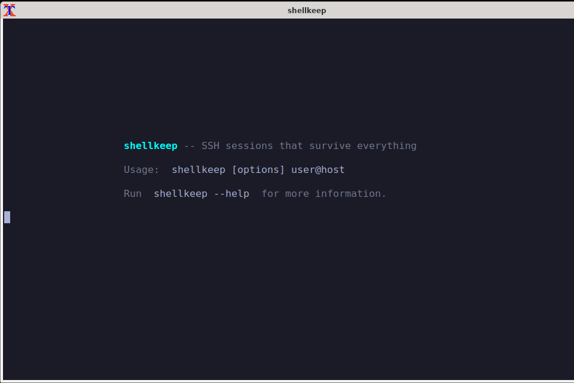
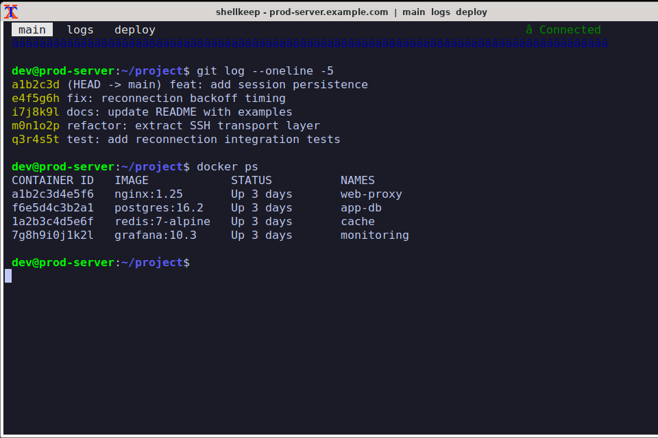
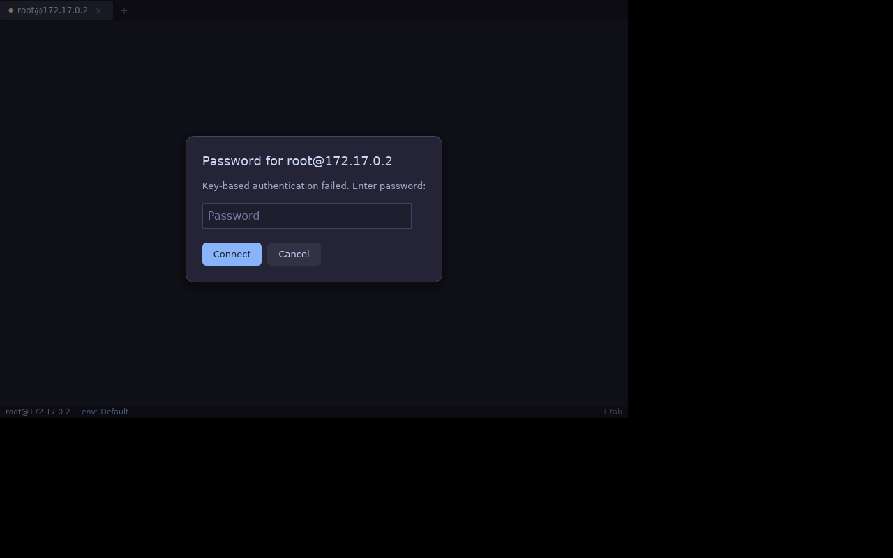

<!--
SPDX-FileCopyrightText: 2026 shellkeep contributors
SPDX-License-Identifier: GPL-3.0-or-later
-->

<p align="center">
  <h1 align="center">shellkeep</h1>
  <p align="center">
    <strong>SSH sessions that survive everything.</strong>
    <br />
    Open source. Cross-platform. Zero server setup.
  </p>
</p>

<p align="center">
  <a href="https://github.com/shellkeep/shellkeep/actions/workflows/ci-rust.yml"></a>
  <a href="https://www.gnu.org/licenses/gpl-3.0"></a>
  <a href="https://github.com/shellkeep/shellkeep/releases"></a>
</p>

<p align="center">
  <em>Connect. Create tabs. Lose your network. Get everything back -- automatically.</em>
</p>

---

## The problem

You SSH into a server, set up your terminal tabs, get deep into a debugging session -- and your Wi-Fi drops. Or your laptop sleeps. Or your VPN reconnects. **Everything is gone.** You reconnect, re-create your layout, try to remember where you were. This happens multiple times a day.

## The solution

**shellkeep** is a cross-platform terminal that makes SSH sessions permanent. It pairs with tmux on the server (which you probably already have) to keep your sessions alive across any interruption. When your connection drops, shellkeep reconnects automatically and restores your exact terminal state -- every tab, every scroll position, every running process. No server-side installation required. No accounts. No cloud.

---

## Features

**Persistent sessions** -- Backed by tmux on the server. Your sessions survive reboots, network changes, and laptop sleep. No extra daemons needed.

**Automatic reconnection** -- Exponential backoff with jitter. When your network comes back, shellkeep reconnects and reattaches -- across all tabs simultaneously.

**Multi-tab interface** -- Create, rename, and organize tabs. Each tab maps to a tmux session on the server.

**Per-device layout sync** -- Each computer remembers its own window and tab arrangement. Open shellkeep on your desktop and laptop with different layouts for the same server.

**Dead session recovery** -- If a session ended while you were disconnected, shellkeep detects and displays the dead session so you can create a new one in its place.

**System tray** -- Minimize to tray and let sessions persist in the background. One-click to restore your windows.

**Zero server config** -- The server only needs tmux (3.0+) and sshd. No shellkeep installation, no custom daemons, no root access.

**Host key verification (TOFU)** -- Trust-on-first-use with SHA256 fingerprint display. Explicit cipher, MAC, and KEX configuration.

**Workspaces** -- Named groups of windows and sessions per server. Run multiple workspaces on the same server to separate contexts like "Backend", "Frontend", and "DevOps".

**GPU-accelerated terminal** -- Powered by alacritty_terminal (same engine as Zed and Alacritty). True color, Unicode, hyperlinks, perfect TUI rendering.

**Cross-platform** -- Runs natively on Linux, macOS, and Windows. Same codebase, native feel everywhere.

**i18n ready** -- English and Brazilian Portuguese (pt_BR) included. Gettext-ready for community translations.

---

## Quick start

```bash
# Linux: Download the AppImage
chmod +x shellkeep-*.AppImage
./shellkeep-*.AppImage user@server.com

# macOS: Download the .dmg, drag to Applications
shellkeep user@server.com

# That's it. Your sessions now survive everything.
```

---

## Screenshots

| | |
|:---:|:---:|
|  **Welcome screen** |  **Multi-tab terminal** |
|  **Password dialog** | |

---

## Comparison

| Feature | shellkeep | Termius | Eternal Terminal | Mosh | Tabby |
|:---|:---:|:---:|:---:|:---:|:---:|
| Persistent sessions | &#x2705; | Partial | &#x2705; | &#x2705; | &#x274C; |
| Multi-device layout sync | &#x2705; | &#x274C; | &#x274C; | &#x274C; | Partial |
| Auto-reconnect | &#x2705; | &#x274C; | &#x2705; | &#x2705; | &#x274C; |
| Dead session recovery | &#x2705; | &#x274C; | &#x274C; | &#x274C; | &#x274C; |
| Open source | &#x2705; GPL-3.0 | &#x274C; | &#x2705; Apache-2.0 | &#x2705; GPL-3.0 | &#x2705; MIT |
| Cross-platform native | &#x2705; Rust/iced | &#x274C; Electron | &#x2705; CLI only | &#x2705; CLI only | &#x274C; Electron |
| No server agent required | &#x2705; tmux only | &#x274C; | &#x274C; etserver | &#x274C; mosh-server | N/A |
| Linux + macOS + Windows | &#x2705; | &#x2705; | &#x274C; Linux only | &#x274C; Unix only | &#x2705; |
| Zero config / free | &#x2705; | &#x274C; Account req. | &#x274C; Server config | &#x2705; | &#x274C; Plugin setup |

---

## How it works

shellkeep is a **client-only** application. The architecture is simple:

1. **Connect** -- shellkeep opens an SSH connection to the server
2. **Attach** -- On the server, it creates or reattaches to tmux sessions (one per tab)
3. **Sync** -- Layout state (tabs, names, positions) is stored as a small state file (`~/.shellkeep/`, typically <10 KB) on the server via SFTP, keyed by device ID
4. **Reconnect** -- When the connection drops, shellkeep retries with exponential backoff and reattaches to the same tmux sessions -- all output is preserved

No installation on the server -- no binaries, no daemons, no root access. Just a tiny state file in `~/.shellkeep/`.

---

## Installation

### Linux

**AppImage (recommended)**

```bash
chmod +x shellkeep-*.AppImage
./shellkeep-*.AppImage user@server.com
```

**Debian / Ubuntu**

```bash
sudo apt update
sudo apt install shellkeep
```

### macOS

Download the `.dmg` from the [releases page](https://github.com/shellkeep/shellkeep/releases), open it, and drag ShellKeep to Applications.

Or via Homebrew (coming soon):

```bash
brew install --cask shellkeep
```

### Windows

Download the installer from the [releases page](https://github.com/shellkeep/shellkeep/releases).

### Build from source

```bash
# Install Rust (if not already installed)
curl --proto '=https' --tlsv1.2 -sSf https://sh.rustup.rs | sh

# Linux only: install system dependencies
sudo apt install libxkbcommon-dev libwayland-dev libvulkan-dev libfontconfig1-dev

# Build
git clone https://github.com/shellkeep/shellkeep.git
cd shellkeep
cargo build --release
# Binary at target/release/shellkeep (~19MB)
```

---

## Usage

```bash
shellkeep user@server.com                    # Basic connection
shellkeep -p 2222 user@server.com            # Custom port
shellkeep -i ~/.ssh/id_ed25519 user@server   # Specific key
shellkeep --minimized user@server.com        # Start in tray
shellkeep --debug user@server.com            # Debug logging
shellkeep --debug=ssh,tmux user@server.com   # Targeted debug
```

---

## Configuration

shellkeep works out of the box with no configuration. Optionally, create `~/.config/shellkeep/config.toml`:

```toml
[general]
client_id = work-laptop            # Human-readable device name
theme = dark                       # "dark", "light", or "system"

[terminal]
font_family = JetBrains Mono
font_size = 13
cursor_shape = ibeam               # "block", "ibeam", "underline"

[ssh]
connect_timeout = 15
keepalive_interval = 30

[reconnect]
max_attempts = 20
base_delay = 1
max_delay = 60
```

---

## Keyboard shortcuts

All shortcuts use `Ctrl+Shift` to avoid conflicts with remote applications.

| Shortcut | Action |
|:---|:---|
| `Ctrl+Shift+T` | New tab |
| `Ctrl+Shift+W` | Close tab |
| `Ctrl+Shift+N` | New window |
| `F2` | Rename current tab |
| `Ctrl+Tab` / `Ctrl+Shift+Tab` | Next / previous tab |
| `Ctrl+Shift+C` / `Ctrl+Shift+V` | Copy / paste |
| `Ctrl+Shift+Plus` / `Minus` / `0` | Zoom in / out / reset |

All shortcuts are customizable in `config.toml`.

---

## Requirements

### Client (your machine)

- **Linux**: No dependencies (statically linked, ~19MB binary)
- **macOS**: macOS 12+ (Monterey or later)
- **Windows**: Windows 10+ (64-bit)

### Server (remote)

- **tmux >= 3.0** -- the only requirement
- No shellkeep installation, no custom daemons, no root access needed

---

## Documentation

| Document | Description |
|:---|:---|
| [ARCHITECTURE](docs/ARCHITECTURE.md) | Layered architecture and data flow |
| [STATE-FORMAT](docs/STATE-FORMAT.md) | State file JSON schema |
| [CONTRIBUTING](CONTRIBUTING.md) | How to build, test, and contribute |
| [CHANGELOG](CHANGELOG.md) | Release history |
| [SECURITY](SECURITY.md) | Vulnerability disclosure policy |
| [CODE_OF_CONDUCT](CODE_OF_CONDUCT.md) | Community guidelines |

Run `man shellkeep` after installation for the full manual page.

---

## Contributing

We welcome contributions of all kinds -- bug reports, feature requests, code, documentation, and translations.

See [CONTRIBUTING.md](CONTRIBUTING.md) for setup instructions and guidelines. External contributors are asked to sign a [Contributor License Agreement](CLA.md) before their changes can be merged.

---

## Roadmap

**Current (v0.3)**

- GPU-accelerated Rust UI with iced + alacritty_terminal (Linux, macOS, Windows)
- Single-hop SSH with full tmux integration
- Per-device layout persistence and workspaces
- AppImage, .deb, .dmg, and Windows installer
- English and pt_BR localization

**Future**

- RPM and Flatpak packages
- Homebrew cask
- Multi-hop SSH (ProxyJump)
- Local integrations (URL opening, file drag-and-drop, notifications)
- Plugin system
- Split panes within tabs

---

## License

shellkeep is licensed under the **GNU General Public License v3.0 or later** (GPL-3.0-or-later). See [LICENSE](LICENSE) for the full text.

---

<p align="center">
  <a href="https://shellkeep.org">Website</a> &middot;
  <a href="https://github.com/shellkeep/shellkeep">Source</a> &middot;
  <a href="https://github.com/shellkeep/shellkeep/issues">Issues</a> &middot;
  <a href="mailto:security@shellkeep.org">Security</a>
</p>
